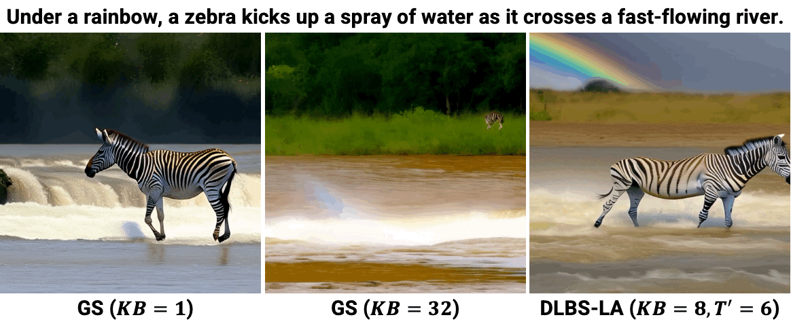
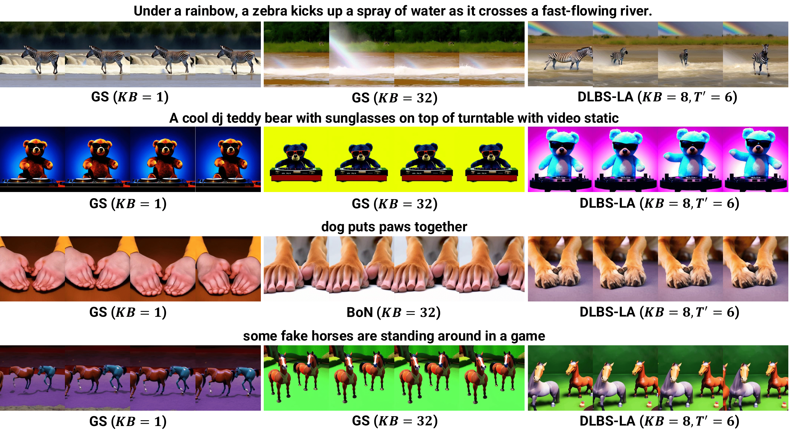

# T2V-Diffusion-Search

## Inference-Time Text-to-Video Alignment with Diffusion Latent Beam Search

[](https://arxiv.org/abs/2501.19252)
[](https://sites.google.com/view/t2v-dlbs)

<!--  -->
<p align="center">
    
</p>

## Abstract
The remarkable progress in text-to-video diffusion models enables photorealistic generations, although the contents of the generated video often include unnatural movement or deformation, reverse playback, and motionless scenes. Recently, an alignment problem has attracted huge attention, where we steer the output of diffusion models based on some quantity on the goodness of the content. Because there is a large room for improvement of perceptual quality along the frame direction, we should address which metrics we should optimize and how we can optimize them in the video generation. In this paper, we propose diffusion latent beam search with lookahead estimator, which can select better diffusion latent to maximize a given alignment reward, at inference time. We then point out that the improvement of perceptual video quality considering the alignment to prompts requires reward calibration by weighting existing metrics. When evaluating outputs by using vision language models as a proxy of humans, many previous metrics to quantify the naturalness of video do not always correlate with evaluation and also depend on the degree of dynamic descriptions in evaluation prompts. We demonstrate that our method improves the perceptual quality based on the calibrated reward, without model parameter update, and outputs the best generation compared to greedy search and best-of-N sampling. We provide practical guidelines on which axes, among search budget, lookahead steps for reward estimate, and denoising steps, in the reverse diffusion process, we should allocate the inference-time computation.
<p align="center">
    
</p>

## Settings
### Download Python Libraries
Please use `./Dockerfile` to build docker image or install python libraries specified in this dockerfile.

### Download Weights
```
bash download_weight.sh
```

## Run Inference
```
# DLBS
python3 sample/sample_t2x.py --config configs/config_dlbs.yaml
# DLBS-LA
python3 sample/sample_t2x.py --config configs/config_dlbs_la.yaml
```

## Citation

```bibtex
@article{oshima2025inference,
  title     = {Inference-Time Text-to-Video Alignment with Diffusion Latent Beam Search},
  author    = {Yuta Oshima and Masahiro Suzuki and Yutaka Matsuo and Hiroki Furuta},
  journal   = {arXiv preprint arXiv:2501.19252},
  year      = {2025},
  url       = {https://arxiv.org/abs/2501.19252},
}
```

## Acknowledgement

We sincerely thank those who have open-sourced their works including, but not limited to, the repositories below:

- https://github.com/huggingface/diffusers
- https://github.com/Vchitect/Latte 
- https://github.com/Vchitect/VBench 