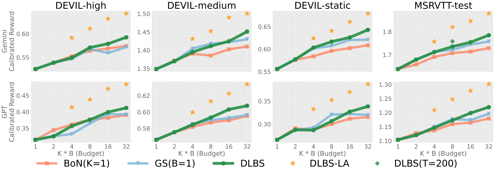
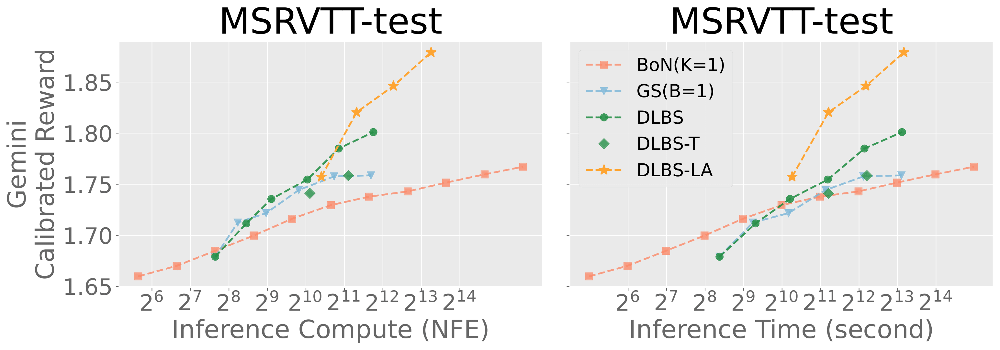

# T2V-Diffusion-Search

## Inference-Time Text-to-Video Alignment with Diffusion Latent Beam Search

[](https://arxiv.org/abs/2501.19252)
[](https://sites.google.com/view/t2v-dlbs)

<!--  -->
<p align="center">
    
</p>

## How to Work
**Diffusion latent beam search (DLBS)** seeks a better diffusion path over the reverse process; sampling K latents per beam and possessing B beams for the next step, which mitigates the effect from inaccurate argmax. **Lookahead estimator** notably reduces the noise at latent reward evaluation by interpolating the rest of the time steps from the current latent with deterministic DDIM.
<p align="center">
    
</p>

## Trade-off between Generation Compute and Alignment
**Comparison among diffusion latent beam search (DLBS), best-of-N (BoN) and greedy search (GS).**
We measure the performance in terms of a combinational reward calibrated to Gemini (above) and GPT-4o (below).
**DLBS** improves all the calibrated reward the best as the search budget $KB$ increases (especially $KB=16,32$) while BoN and GS in some cases eventually slows down or saturates the performance.
Notably, **Lookahead estimator** ($T'=6$, $KB=8$) is comparable to or even outperforming DLBS ($KB=32$).

<p align="center">
    
</p>

**DLBS** achieves more efficient performance gains compared to BoN and GS in terms of execution time.
Furthermore, employing our **Lookahead estimator** further accentuates these benefits, demonstrating that **slight additional computational overhead** realizes the improved alignment performance much more efficiently than with BoN or GS.

<p align="center">
    
</p>

## Settings
### Install Libraries
Please use `./Dockerfile` to build docker image or install python libraries specified in this dockerfile.

### Download Weights
```
bash download_weight.sh
```

## Run Inference
We provide two configuration files in the `configs/${method}` directory. 
Below are examples of how to run inference with different settings:
```
# No DLBS 
python3 sample/sample_t2x.py --config configs/kb1/static.yaml
# DLBS 
python3 sample/sample_t2x.py --config configs/dlbs/static.yaml
# DLBS-LA 
python3 sample/sample_t2x.py --config configs/dlbs_la/static.yaml
```

## Citation

```bibtex
@article{oshima2025inference,
  title     = {Inference-Time Text-to-Video Alignment with Diffusion Latent Beam Search},
  author    = {Yuta Oshima and Masahiro Suzuki and Yutaka Matsuo and Hiroki Furuta},
  journal   = {arXiv preprint arXiv:2501.19252},
  year      = {2025},
  url       = {https://arxiv.org/abs/2501.19252},
}
```

## Acknowledgement

We sincerely thank those who have open-sourced their works including, but not limited to, the repositories below:

- https://github.com/huggingface/diffusers
- https://github.com/Vchitect/Latte 
- https://github.com/Vchitect/VBench 