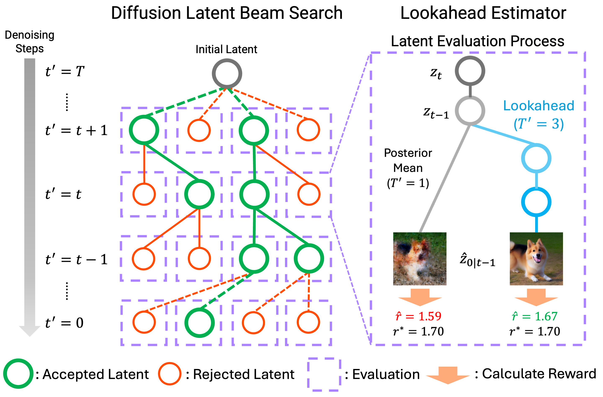

# T2V-Diffusion-Search

## Inference-Time Text-to-Video Alignment with Diffusion Latent Beam Search

[](https://arxiv.org/abs/2501.19252)
[](https://sites.google.com/view/t2v-dlbs)



## Settings
### Download Python Libraries
Please use `./Dockerfile` to build docker image or install python libraries specified in this dockerfile.

### Download Weights
```
bash download_weight.sh
```

## Run Inference
```
# DLBS
python3 sample/sample_t2x.py --config configs/config_dlbs.yaml
# DLBS-LA
python3 sample/sample_t2x.py --config configs/config_dlbs_la.yaml
```

## Citation

```bibtex
@article{oshima2025inference,
  title     = {Inference-Time Text-to-Video Alignment with Diffusion Latent Beam Search},
  author    = {Yuta Oshima and Masahiro Suzuki and Yutaka Matsuo and Hiroki Furuta},
  journal   = {arXiv preprint arXiv:2501.19252},
  year      = {2025},
  url       = {https://arxiv.org/abs/2501.19252},
}
```

## Acknowledgement

We sincerely thank those who have open-sourced their works including, but not limited to, the repositories below:

- https://github.com/huggingface/diffusers
- https://github.com/Vchitect/Latte 
- https://github.com/Vchitect/VBench 